# PixG — AI 픽셀 스프라이트 시트 생성기 🏆

> **메타버스 아카데미 2기 최종 프로젝트 최우수상** (2023.12.12) · 발주처 한국전파진흥협회
> 2023.09 ~ 2023.11 (6주) · 5인 팀 · 담당: **AI 파트**

프롬프트 한 번으로 **게임에 바로 넣을 수 있는** 픽셀 스프라이트 시트를 자동 생성합니다.
기존 생성형 AI가 "픽셀 느낌의 이미지"까지만 만들고 멈추는 지점에서, **배경 제거와 균일 배치까지 자동화해 에셋으로 완성**한 것이 차별점입니다.

<p align="center">
  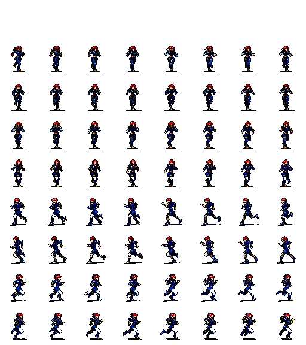<br>
  <em>최종 산출물 — 달리기 64프레임 · 64×64 · 8열 격자</em>
</p>

> ### 이 저장소에 대하여
>
> **2023년 9~11월에 진행한 프로젝트입니다.** 2023년 12월에 프론트엔드를 먼저 올렸고(`2023-12-14` 커밋), 2026년에 **AI 파트 작업물과 산출물을 추가해 저장소를 재구성**했습니다.
> 당시 작업 폴더(ComfyUI 런타임 포함 75GB)에서 본인 작업물만 추렸으며, 코드와 워크플로우는 **2023년 당시 그대로**이고 수정하지 않았습니다.
>
> | | |
> |---|---|
> | **진행 시기** | 2023.09 ~ 2023.11 (6주) · 5인 팀 |
> | **최초 업로드** | 2023.12.14 (프론트엔드) |
> | **AI 파트 추가·재구성** | 2026.09 |
> | **담당 파트** | **AI** — 생성 파이프라인 · 후처리 · 워크플로우 설계 |
> | **팀원 작업** | `frontend/` — SERVER 파트 팀원 제작 ([ATTRIBUTION](frontend/ATTRIBUTION.md)) |
>
> 당시 코드의 버그도 고치지 않고 [알려진 문제](#알려진-문제-2023년-당시-코드-그대로-둡니다)로 기록만 해두었습니다. **보여주려는 것이 지금의 실력이 아니라 당시의 판단과 결과물**이기 때문입니다.

---

## 결과물

프롬프트 한 줄에서 아래 결과물이 나옵니다. **전부 이 저장소의 워크플로우로 생성한 실제 출력물입니다.**

### 캐릭터 애니메이션 → 스프라이트 시트

AnimateDiff로 **64프레임 영상**을 생성한 뒤 프레임을 추출해 격자로 배치합니다.

| | | |
|:---:|:---:|:---:|
| 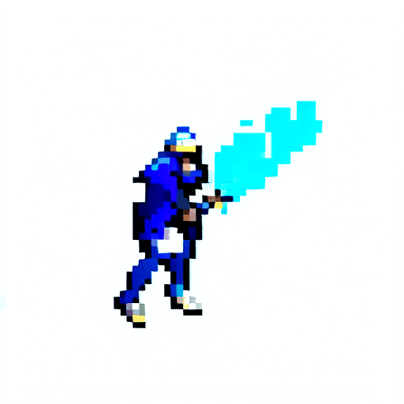 |  | 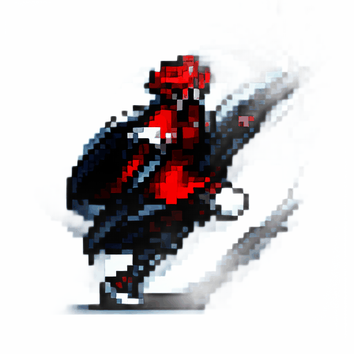 |
| **검 휘두르기** · 파란 옷 — 25프레임 | **점프** · 빨간 옷 — 38프레임 | **달리기** · 빨간 머리, 붉은 옷 — 25프레임 |
| 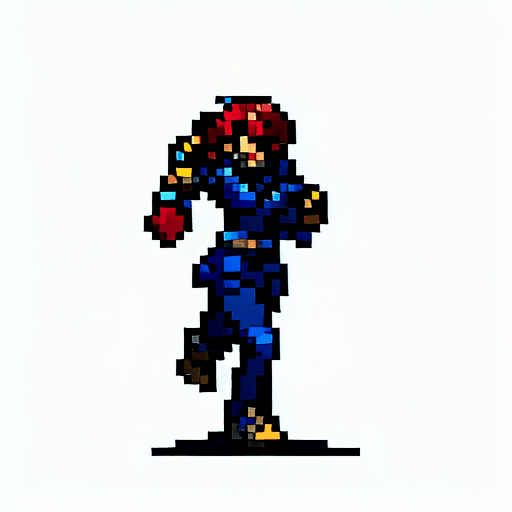 | 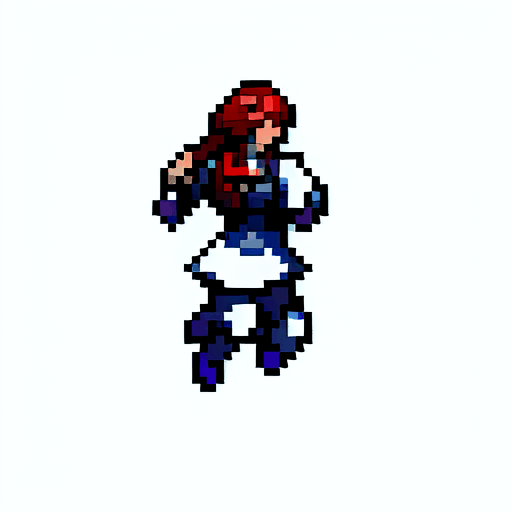 | |
| **달리기** · 빨간 머리, 파란 옷 — 64프레임 | **달리기** · 빨간 머리, 흰 옷 — 64프레임 | |

**달리기뿐 아니라 검 공격·점프까지** 같은 파이프라인으로 생성했습니다.
위 세 편은 당시 서비스 데모 페이지에 실렸던 결과물입니다.

### 같은 파이프라인, 다른 동작

| | |
|:---:|:---:|
| 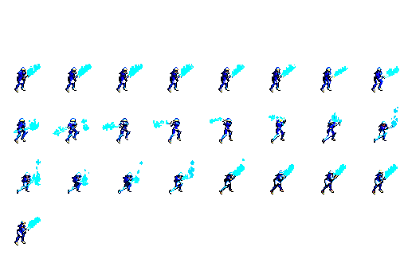 |  |
| **검 휘두르기** 25프레임 · 8×4 격자 | **달리기** 64프레임 · 8×8 격자 |

프레임 수가 달라도 **8열 격자에 맞춰 자동으로 행이 늘어나고, 8의 배수가 아니면 투명 프레임으로 채웁니다.** 후처리 코드를 고치지 않고 두 동작 모두 처리했습니다.

### 조건 ① — 프레임이 바뀌어도 같은 캐릭터인가

이 프로젝트의 핵심입니다. 아래는 **한 번의 AnimateDiff 생성에서 나온 연속 프레임**을 일정 간격으로 뽑은 것입니다.

| | | | | |
|:---:|:---:|:---:|:---:|:---:|
| 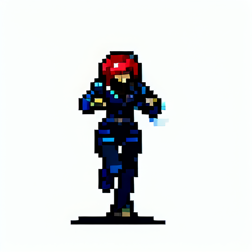 | 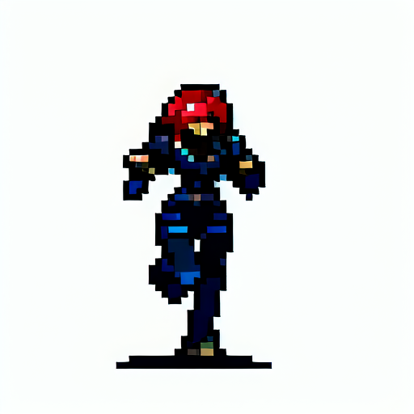 |  | 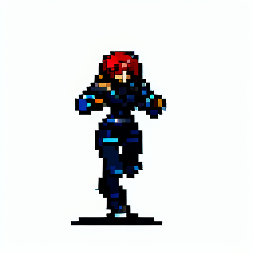 | 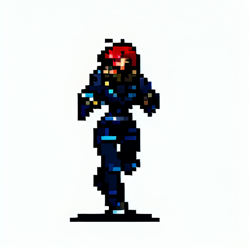 |

**동작은 바뀌지만 붉은 머리·짙은 남색 갑옷·장식 위치가 그대로 유지됩니다.** 5장 모두 같은 seed(`999432851959333`)·같은 프롬프트에서 나온 **하나의 영상의 프레임**입니다 — PNG 메타데이터로 확인할 수 있습니다.

Text2Img로 한 장씩 뽑던 때는 이 지점에서 머리색과 옷 디테일이 프레임마다 달라졌습니다. **영상으로 만들면 일관성이 결과가 아니라 전제가 된다**는 것이 이 5장입니다.

> 전환 **이전**의 실패 사례 이미지(Text2Img 개별 생성물)는 당시 남겨두지 않아 이 저장소에 없습니다. 위 이미지는 전환 **이후**의 결과입니다.

| 후처리 전 (영상) | 후처리 후 (스프라이트 시트) |
|:---:|:---:|
| 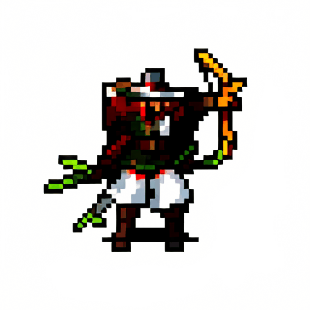 |  |
| 배경 제거 + GIF 미리보기 | 64×64 통일 · 8열 격자 (64프레임) |

### 단일 캐릭터

| | | |
|:---:|:---:|:---:|
| 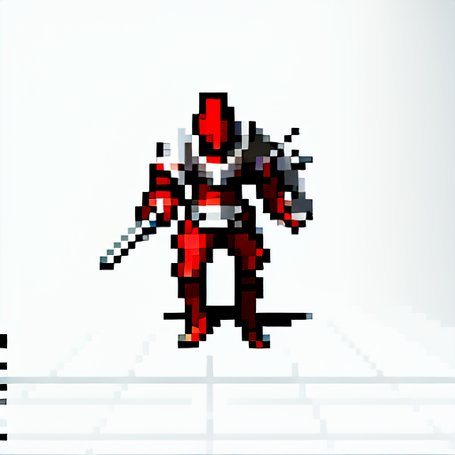 | 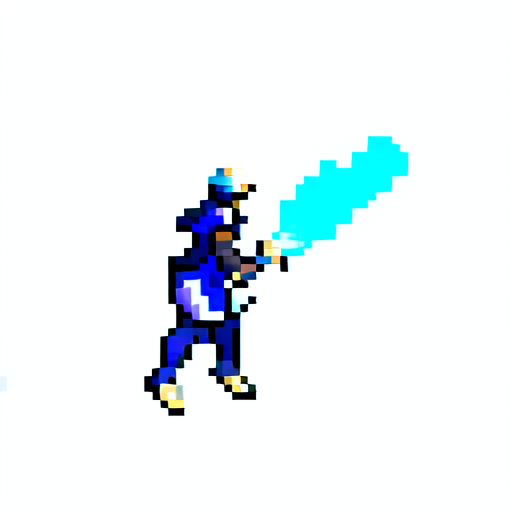 | |
| 붉은 기사 | 원거리 공격 모션 | |

### 건물 · 사물 (별도 갈래)

캐릭터와 **다른 체크포인트·LoRA**를 씁니다 (`handpaintedRPGIcons` + `Isometric_Setting`).

| | | | |
|:---:|:---:|:---:|:---:|
| 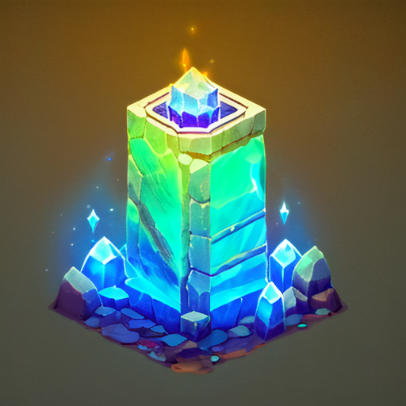 | 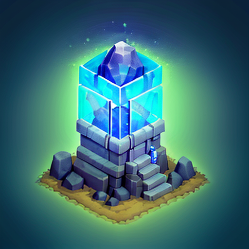 | 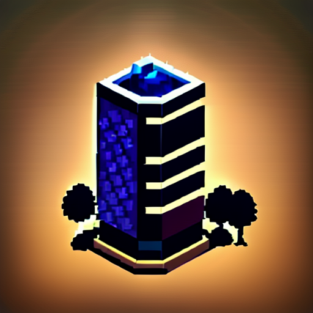 | 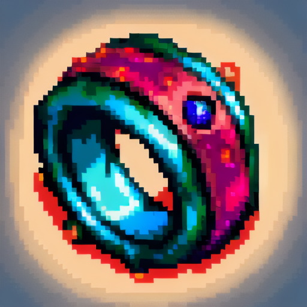 |
| 크리스탈 타워 | 신전 | 아이소메트릭 건물 | 아이템 아이콘 |

> 💡 `assets/showcase/` 의 PNG에는 **ComfyUI 워크플로우가 메타데이터로 들어 있습니다.** 이미지를 ComfyUI 캔버스에 끌어다 놓으면 생성에 쓰인 워크플로우가 그대로 복원됩니다.

---

## 무엇이 문제였나

스프라이트 시트는 캐릭터의 동작 프레임을 격자로 모아둔 비트맵입니다. 슈퍼마리오부터 메타버스 플랫폼 ZEP의 아바타까지 2D 캐릭터가 움직이는 모든 곳에 쓰이는데, **제작 방식이 여전히 수작업**이었습니다.

그래서 "픽셀 이미지를 잘 만든다"는 검증 불가능한 목표 대신, **게임 엔진에 바로 투입 가능한 조건 4개**를 먼저 못박고 시작했습니다.

| # | 조건 | DALL·E 3 | Pixelvibe | **PixG** |
|---|---|:---:|:---:|:---:|
| ① | 캐릭터 특징 유지 | ○ | ✕ | **○** |
| ② | 미세하게 다른 동작 | ○ | ○ | **○** |
| ③ | 배경 제거 | ✕ | ✕ | **○** |
| ④ | 균일한 이미지 간격 | ✕ | ✕ | **○** |

경쟁 서비스는 **③④를 충족하지 못합니다.** 이미지는 나오지만 사람이 다시 손을 대야 합니다.
**자동화가 끊기는 지점이 정확히 여기였고, 이 두 칸을 채우는 것이 이 프로젝트의 기여였습니다.**

---

## 핵심 문제 — 이미지 일관성

Text2Img로 동작 프레임을 여러 장 생성했더니 **같은 프롬프트인데도 프레임마다 외형이 달라졌습니다.** 머리색이 바뀌고 옷 디테일이 달라졌습니다. 조건 ①이 무너지는 치명적 오류였습니다.

| # | 시도 | 결과 |
|---|---|---|
| 1 | Seed 고정 | 프롬프트가 조금만 달라져도 결과가 변함 → 실패 |
| 2 | Img2Img | 동작이 커질수록 원본에서 멀어짐 → 실패 |
| 3 | ControlNet (OpenPose) | 포즈는 유지되나 외형 일관성 부족 → 부분 성공 |
| 4 | SD XL vs SD 1.5 | 픽셀 아트에는 SD 1.5 + 픽셀 LoRA가 적합 → **SD 1.5 채택** |
| 5 | 자체 LoRA 학습 vs 공개 LoRA | 공개 LoRA 품질이 우수 → **공개 LoRA 채택** |

### 실패 3건의 공통점

Seed 고정·Img2Img·ControlNet은 **모두 "따로 만든 이미지를 사후적으로 비슷하게 맞추려는" 접근**이었습니다.
같은 방향으로 세 번 실패했다면 방법이 아니라 전제를 의심해야 한다고 판단했습니다.

### 전환

> **"이미지를 여러 장 생성하는 것이 아니라, 영상을 생성하고 프레임을 추출한다."**

영상은 애초에 시간축으로 연결된 하나의 생성물이므로, **프레임 간 일관성이 결과가 아니라 전제**가 됩니다.
AnimateDiff 기반 Vid2Vid로 바꾸자 **조건 ①과 ②가 동시에 해결**됐습니다.

ControlNet은 버리지 않고 **동작을 지정하는 역할**로 옮겼습니다 — 일관성은 AnimateDiff가, 동작 지정은 ControlNet이 맡습니다.

---

## 파이프라인

```
프롬프트
   ↓
AnimateDiff (SD 1.5 + 픽셀 LoRA + ControlNet)   ← 조건 ①②
   ↓  GIF 16fps
PIL 프레임 추출
   ↓
InSPyReNet 배경 제거 (rgba판 + 흰 배경판)        ← 조건 ③
   ↓
ESRGAN 계열 1x 복원 (DeJpeg · PixelSharpen)
   ↓
OpenCV  resize(64×64) → 8열 hstack → vstack      ← 조건 ④
   ↓
스프라이트 시트 PNG + GIF 미리보기
```

**단계별 실제 결과물이 `assets/pipeline/` 에 그대로 들어 있습니다.**

| 폴더 | 내용 |
|---|---|
| `00-source.gif` | AnimateDiff 생성 원본 (64프레임) |
| `01-frames-raw/` | 프레임 추출 직후 (배경 있음) · 64장 |
| `02-frames-nobg-rgba/` | 배경 제거 (투명) · 64장 |
| `03-frames-nobg-white/` | 배경 제거 (흰 배경) · 64장 |
| `04-preview.gif` | 미리보기 GIF |
| `../showcase/01-spritesheet-run.png` | **최종 스프라이트 시트** (8×8) |

> ### 이 단계별 결과물은 2026년에 재실행한 것입니다
>
> **`src/postprocessing.py` 를 한 줄도 고치지 않고**, 2023년에 생성해 둔 `AnimateDiff_00041_.gif`(64프레임)를 입력으로 2026-09-17에 실행한 결과입니다.
> 2023년 당시의 산출물은 `assets/pipeline-2023-archer/` 와 `assets/showcase/12-spritesheet-archer-2023.png` 에 그대로 보존했습니다 (24프레임 · 8×3).
>
> 당시 완성된 스프라이트 시트가 한 장(궁수)뿐이었고 그 생성물의 품질이 낮아, **더 잘 나온 영상으로 같은 코드를 다시 돌렸습니다.** 코드·입력 모두 2023년 것이므로 파이프라인의 실제 동작을 그대로 보여줍니다.

같은 프레임 번호끼리 비교하면 각 단계가 무엇을 바꿨는지 바로 보입니다.

### 판단한 지점 몇 가지

- **ControlNet 가중치를 비대칭으로** — OpenPose `1.0`(포즈는 조건 ② 자체라 꽉 고정) + Depth `0.2`(높이면 음영이 과해져 픽셀 아트의 단순한 면이 깨짐)
- **64×64 · 8열 격자 고정** — 프레임 수가 8의 배수가 아니면 투명 프레임으로 패딩해 격자가 깨지지 않게 분기 3개를 둠
- **배경 제거 결과를 두 벌로** — 투명본은 스프라이트용, 흰 배경본은 GIF용 (GIF가 투명도를 담지 못함)
- **1x 복원 모델 선택** — 해상도를 올리는 게 목적이 아니라 **64×64로 줄이기 전에 픽셀 경계를 살리는 것**이 목적
- **GIF 미리보기 제공** — 정지 격자 이미지로는 애니메이션 품질을 판단할 수 없음

---

## 검증 — 실제로 쓰이는지 확인했습니다

생성한 스프라이트 시트를 메타버스 플랫폼 **ZEP에 직접 업로드해 아바타로 정상 동작하는 것까지 확인**했습니다.

<p align="center">
  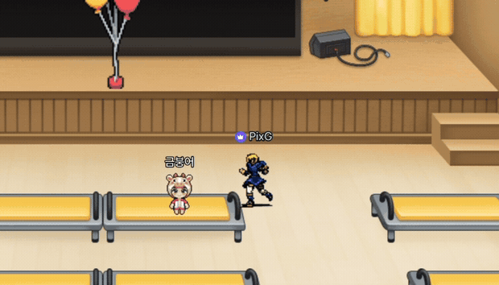<br>
  <em>생성한 캐릭터가 ZEP 아바타(PixG)로 움직이는 장면 — 옆의 분홍 캐릭터가 ZEP 기본 아바타입니다</em>
</p>

**배경이 남거나 격자 간격이 흔들리면 ZEP에 올라가지 않습니다.** 요구조건 4개를 모두 충족했다는 실증입니다.

▶ **전체 시연 영상** — [`assets/demo/pixg-demo.mp4`](assets/demo/pixg-demo.mp4) (57초)
프롬프트 입력 → 생성 → 갤러리 → 다운로드 → ZEP 적용까지 전 과정이 담겨 있습니다.

조건 4개를 정의한 이유도 여기에 있습니다 — **하나라도 빠지면 ZEP에 올라가지 않습니다.** 배경이 남으면 아바타 뒤에 사각형이 보이고, 격자 간격이 흔들리면 걷는 동작이 튑니다.

> 다만 **일관성 개선의 정량 지표는 남기지 못했습니다.** 당시엔 "ZEP에서 동작하는가"를 합격 기준으로 삼았습니다.

---

## 저장소 구성

```
pixg/
├─ workflows/
│  ├─ ui/       ComfyUI UI 포맷 워크플로우 9개 (번호순 = 튜닝 순서)
│  └─ api/      API 포맷 4개
├─ src/postprocessing.py    후처리 전 구간 (209줄)
├─ frontend/                서비스 UI  ⚠️ 팀원(SERVER 파트) 제작 — ATTRIBUTION.md 참조
├─ assets/
│  ├─ showcase/             ⭐ 대표 결과물 11점 (위 갤러리)
│  ├─ pipeline/             후처리 단계별 실제 결과물
│  └─ pose/                 OpenPose 레퍼런스 4세트
├─ docs/
│  ├─ PARAMETERS.md         전 파라미터 실측값
│  └─ ENVIRONMENT.md        GPU·소프트웨어 환경
└─ models/manifest.json     사용 모델 목록 + 출처 (가중치는 미포함)
```

**모델 가중치(`.safetensors` · `.ckpt` · `.pth`)는 저장소에 포함하지 않습니다.**
전부 공개 배포본이며 파일명과 출처는 `models/manifest.json` 에 적어두었습니다.

## 재현 방법

```bash
# 1. ComfyUI 설치 후 ComfyUI-Manager로 커스텀 노드 설치
#    (목록: docs/ENVIRONMENT.md)

# 2. models/manifest.json 의 모델을 ComfyUI/models/ 하위에 배치

# 3. workflows/ui/*.json 을 ComfyUI에 Load → GIF 생성

# 4. 후처리
pip install transparent-background opencv-python pillow imageio numpy matplotlib
```

⚠️ **`postprocessing.py` 는 실행 위치에 의존합니다.** 스크립트 기준이 아니라 **현재 작업 디렉터리 기준으로 `../output/` 을 찾습니다.**

```
작업폴더/
├─ scripts/          ← 여기서 실행해야 합니다
│   └─ postprocessing.py
└─ output/           ← ComfyUI가 GIF를 뱉는 곳
    └─ *.gif
```

```bash
cd scripts
python postprocessing.py    # ../output/ 의 가장 마지막 GIF를 읽습니다
```

결과는 `../output/` 아래 `pre_rm_bg/` · `rm_bg_png/` · `rm_bg_white/` · `rm_bg_gif/` · `spritesheet/` 로 떨어집니다.

## 알려진 문제 (2023년 당시 코드 그대로 둡니다)

실제로 돌려서 확인한 것들입니다. **포트폴리오는 당시 결과물을 보여주는 것이 목적이라 고치지 않고 기록만 해둡니다.**

| # | 문제 | 영향 |
|---|---|---|
| 1 | **스프라이트 시트 맨 윗줄이 빈 행** | 24프레임이면 3행(192px)이면 충분한데 **4행(256px)** 이 나옵니다 |
| 2 | 경로 분리가 `split('\\')` — **Windows 전용** | Linux/macOS에서는 동작하지 않습니다 |
| 3 | 실행 위치에 의존 (`'../output'`) | 위 재현 방법 참조 |

### 1번 상세

격자를 만들 때 `reduce`의 초기값으로 넣은 투명 블록이 **가로 방향만 제거되고 세로 방향은 남습니다.**

```python
stacked_img = reduce(vstack_img, stack_list, np.zeros_like(stack_list[0]))
stacked_img = stacked_img[:, 64:]    # ← 열(가로)만 잘라냄. 행(세로)은 그대로
```

`[:, 64:]` 가 **열만** 잘라내므로 맨 위 빈 행이 남습니다. `stacked_img[64:, 64:]` 로 고치면 해결됩니다.
`assets/showcase/01-spritesheet-run.png` 에도 이 빈 행이 그대로 있습니다 — 당시 산출물 그대로이기 때문입니다. 맨 위 갤러리 이미지에서 눈으로 확인하실 수 있습니다.

> 게임 엔진이 이 시트를 8×4로 자르면 **맨 윗줄 8칸이 빈 프레임**으로 들어옵니다. 당시에는 엔진에서 시작 프레임을 지정해 쓸 수 있어 문제로 인식하지 못했습니다.

## 기술 스택

| 구분 | 기술 |
|---|---|
| 생성 | Stable Diffusion 1.5 · AnimateDiff · ControlNet (OpenPose · Depth) · 픽셀 LoRA |
| 이미지 처리 | InSPyReNet (SOD) · ESRGAN 계열 1x 복원 · OpenCV · PIL · imageio |
| 워크플로우 | ComfyUI · JSON 파이프라인 |
| 프론트엔드 (팀원 담당) | HTML · CSS · jQuery |

## 환경

| | GPU | VRAM |
|---|---|---|
| 개인 노트북 | RTX 3060 Laptop | 6 GB |
| 아카데미 서버 | RTX 4090 | 24 GB |

AnimateDiff는 16프레임을 한 번에 생성해 VRAM을 많이 씁니다. **6GB 환경**에서는 가상메모리 확장과 배치사이즈 조절로 통과시켰습니다. 자세한 내용은 [`docs/ENVIRONMENT.md`](docs/ENVIRONMENT.md).

## 링크

- 발표자료 — https://docs.google.com/presentation/d/1LnbrfAr7dw2uKcaNykFdHlLjef8Z8Vh7/edit
- 시연영상 — https://drive.google.com/file/d/1NlyUxjaGyjRMYz4L-l28-v5acRm0scmy/view

---

## 배운 점

**1. 문제를 검증 가능한 조건으로 쪼개는 것이 먼저입니다.**
"픽셀 이미지를 잘 만든다"는 목표로는 무엇을 해야 할지, 언제 끝났다고 할지 알 수 없습니다. 조건 4개를 못박은 뒤에야 어떤 기술이 필요한지, 경쟁 서비스와 무엇이 다른지가 전부 보였습니다.

**2. 같은 방향으로 세 번 실패하면 전제를 의심해야 합니다.**
실패를 목록으로 남겨두지 않았다면 "셋 다 사후 보정"이라는 공통점을 못 봤을 것입니다.

**3. 여러 도구를 조합하면 개별 도구의 한계를 넘습니다.**
단일 모델로는 조건 4개를 만족할 수 없었습니다. 조건마다 다른 도구를 붙이는 파이프라인이 답이었습니다.

**4. 최신 버전이 항상 좋은 것은 아닙니다.**
SD XL이 전반적 성능은 높았지만, 픽셀 아트 도메인에서는 LoRA 생태계가 풍부한 SD 1.5가 나았습니다. 자체 LoRA 학습보다 공개 LoRA가 품질이 좋았던 것도 같은 종류의 교훈입니다.
